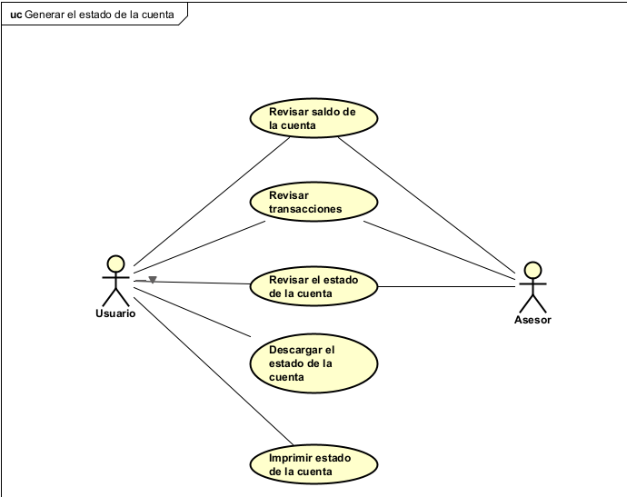
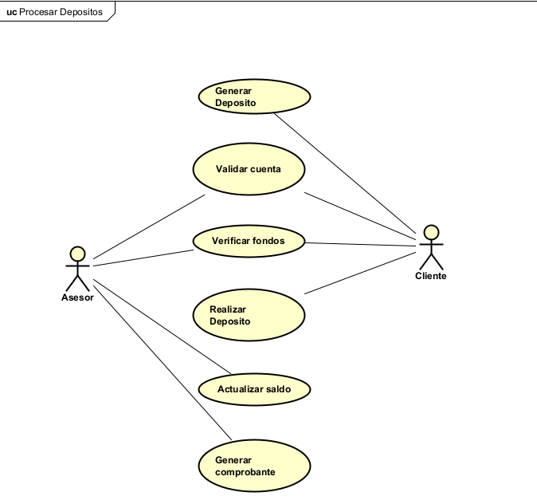
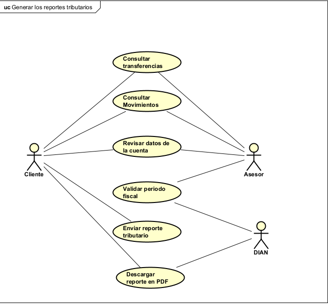
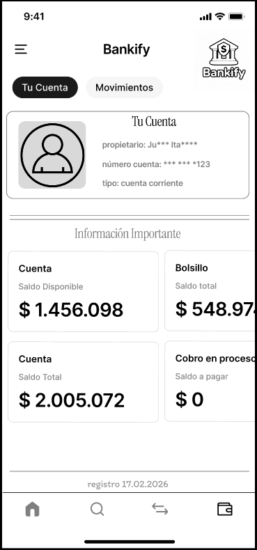
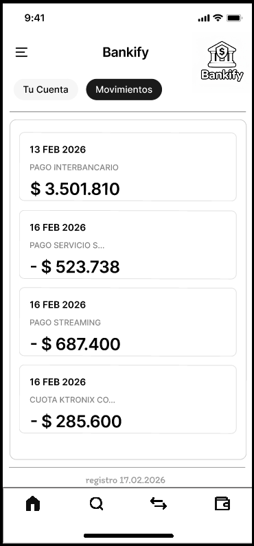
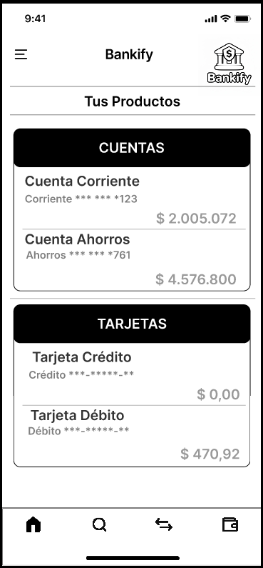

# 📄 Requerimientos del Sistema

## Parte 3

## 1. Lista general de requerimientos

El sistema de Bankify tiene los siguientes requerimientos (descripción a alto nivel):

### 1.1 Requerimientos funcionales

El sistema de Bankify debe tener la capacidad de:

1. Validar estructura de cuenta
2. Gestionar el estado de la cuenta
3. Procesar depósitos
4. Generar los reportes tributarios
5. Eliminar registro de clientes
 
### 1.2 Requerimientos No funcionales

El sistema de Bankify debe tener:

1. Seguridad
2. Udsabilidad
3. Integridad de los Datos
4. Disponibilidad de operación
5. Interoperabilidad 

## 2. Diagramas de caso de uso

### 2.1 Requerimiento Funcional 1

| Campo | Descripción |
|------|-------------|
| **ID** | RF-01 |
| **Nombre del requerimiento** | Gestionar estado de la cuenta |
| **Descripción** | El sistema debe permitir al cliente ver el saldo y datos básicos que posee de sus cuentas vinculadas |
| **Precondiciones** | Para que el sistema cumpla con este requerimiento, Bankify debe tener previamente al cliente autentificado y con al menos una cuenta activa asociada |
| **Actor** | Cliente |
| **Flujo principal** | 1. El actor selecciona la opcion de consular saldo  2. El sistema recupera la info de las cuentas asociadas (id del cliente)  3. El sistema muestra en la pantalla el numero de la cuenta y el saldo disponible|
| **Diagrama de caso de uso** |  |
| **Poscondiciones** | Se espera como resultado que el cliente utilizando el sistema pueda ver su info financiera sin alterar los datos que ya tiene |

### 2.2 Requerimiento Funcional 2

| Campo | Descripción |
|------|-------------|
| **ID** | RF-02 |
| **Nombre del requerimiento** | Realizar depósitos |
| **Descripción** | El sistema debe permitir registrar ingresos del dinero en una especifica cuenta validando así, la existencia de la cuenta antes de la transacción. |
| **Precondiciones** | Para que el sistema cumpla con este requerimiento, Bankify debe tener previamente la cuenta destino existente y validada.  |
| **Actor** | Cliente o usuario externo |
| **Flujo principal** | 1. El actor ingresa el numero de cuenta donde va a depositar y el respectivo monto  2. El sistema validar que la cuenta exista y esté activas  3. El sistema suma el monto al saldo de la cuenta depositada y  registra en un historial la transaccion |
| **Diagrama de caso de uso** |  |
| **Poscondiciones** | Se espera como resultado que el saldo de la cuenta a depositar incremente y se genere el combrobante. |

### 2.3 Requerimiento Funcional 3

| Campo | Descripción |
|------|-------------|
| **ID** | RF-03 |
| **Nombre del requerimiento** | Generar reportes tributarios |
| **Descripción** | El sistema debe generar un documento con el resumen de movimientos anuales para tramites legales.  |
| **Precondiciones** | Para que el sistema cumpla con este requerimiento, Bankify debe tener previamente consolidados los movimientos financieros del año correspondiente a generar. |
| **Actor** | cliente |
| **Flujo principal** | 1. El actor solicita la generación del reporte tributario seleccionando el año correspondiente  2. El sistema compila la info de todas las cuentas pertenecientes al clientes  3. El sistema exporta la información y genera el archivo en formato PDF |
| **Diagrama de caso de uso** |  |
| **Poscondiciones** | Se espera como resultado un PDF con la info recolectada y correcta de los movimientos bancarios del año seleccionado por el actor |

## 3. Preguntas

a. ¿Identifica algún requerimiento que deba detallarse más? ¿cuál(es)?  
La seccion de gestion de clientes pues, tiene varias acciones a realizar como crear, activar, inactivar y actualizar.  

b. ¿Existen requerimientos que se contradigan entre sí? ¿cuál(es)?  
Tal vez la sección de los roles en la gestión de las cuentas, pues, se menciona que el asesor puede realizar todas las acciones, sin embargo, más adelante se indica que el cliente también puede realizar acciones entonces, en ese orden de ideas ¿el cliente puede inactivar una cuenta y el asesor activarla sin su consentimiento?  

c. Si tuviera que dar una prioridad a los requerimientos, ¿cuáles
deberían ser los 2 más importantes que deberían implementarse en
una primera iteración del proyecto?  
Gestion de cuentas con validación de negocio  
realizar depositos  

d. ¿Existe algún requerimiento que no debería realizarse?  
El de generar los reportes tributarios (inicialmente), no son necesarios tan pronto ya que son anuales y pues, implementarlos en una primera interacción complica las cosas y consume recursos.

---

# Parte 4

El requerimiento funcional que se elijio fue:

Gestionar el estado de cuenta.

De esta manera, para realizar el mockup se desengloso basado en el caso de uso realizado anteriormente en la Parte 3, asi mismo, se le agregaron aspectos como ver bolsillo, ver saldo, ver historial de transferencias, etc.

los Mockups diseñados fueron los sigueintes:

---
## Mockup 1 (Cuenta)

## Mockup 2 (Movimientos)

## Mockup 3 (Productos)

