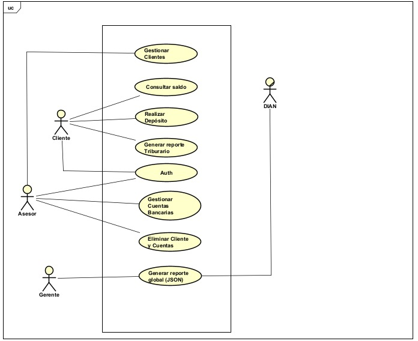

# 📄 Requerimientos del Sistema - Bankify

## 1. Sistema

* **Nombre del sistema:** Bankify Core Management System
* **Objetivo:** El sistema tiene como objetivo validar un modelo de negocio fintech inicial mediante la gestión centralizada de cuentas bancarias, permitiendo operaciones básicas de depósito y consulta bajo estrictas reglas de validación bancaria.

## 2. Problema a resolver

Actualmente, Bankify no cuenta con un sistema centralizado que permita registrar cuentas de manera validada, controlar los saldos en tiempo real, ni cumplir con las obligaciones legales de reportes tributarios. El problema principal es la falta de automatización en la aplicación de reglas de negocio (como los 10 dígitos de cuenta y prefijos por banco) y la carencia de formatos de salida estandarizados como PDF para clientes y JSON para la DIAN.

## 3. Diagrama de Contexto

### 3.1 Diagrama

> *Nota: Verifica que el archivo de imagen tenga exactamente ese nombre y esté en la misma carpeta que este archivo .md*

### 3.2 Actores

| Actor / Rol | Descripción |
| :--- | :--- |
| **Cliente** | Usuario final propietario de las cuentas. Realiza depósitos, consulta saldos, genera su reporte PDF e inactiva sus propias cuentas. |
| **Asesor / Supervisor** | Rol administrativo responsable de la gestión completa (crear, activar, actualizar) tanto de clientes como de cuentas bancarias. |
| **Gerente Financiero** | Usuario de alto nivel encargado de la supervisión contable y de generar el reporte global de todas las cuentas para la entidad tributaria. |
| **DIAN** | (Sistema Externo) Entidad gubernamental que actúa como receptor pasivo del reporte tributario consolidado. |

### 3.3 Sistemas externos

| Sistema | Descripción |
| :--- | :--- |
| **DIAN (Dirección de Impuestos)** | Sistema externo que procesa los datos de declaración de renta enviados por Bankify en formato JSON. |
| **Motor de Reportes** | Componente encargado de la transformación de datos bancarios a documentos legibles (PDF) y archivos de intercambio (JSON). |

## 4. Alcance del sistema

### 4.1 Dentro del sistema
* **Validación de Reglas de Negocio:** Verificación automática de que las cuentas tengan 10 dígitos y pertenezcan a bancos registrados (01-Bancolombia, 02-Davivienda).
* **Módulo de Gestión Humana:** Creación, activación, actualización y eliminación de perfiles de clientes por roles autorizados.
* **Operaciones Bancarias Core:** Registro controlado de depósitos y visualización inmediata de saldos por parte del propietario.
* **Generación de Documentación Legal:** Creación de reportes PDF de declaración de renta para clientes y archivos JSON consolidados para entes externos.

### 4.2 Fuera del sistema
* **Gestión de Créditos:** El sistema no realiza estudios de riesgo crediticio ni otorga préstamos o microcréditos.
* **Pasarela de Pagos:** No se incluyen integraciones con sistemas externos como PSE, tarjetas de crédito o transferencias interbancarias.
* **Manejo de Divisas:** El sistema opera únicamente con moneda local y no realiza conversiones de tipo de cambio.
